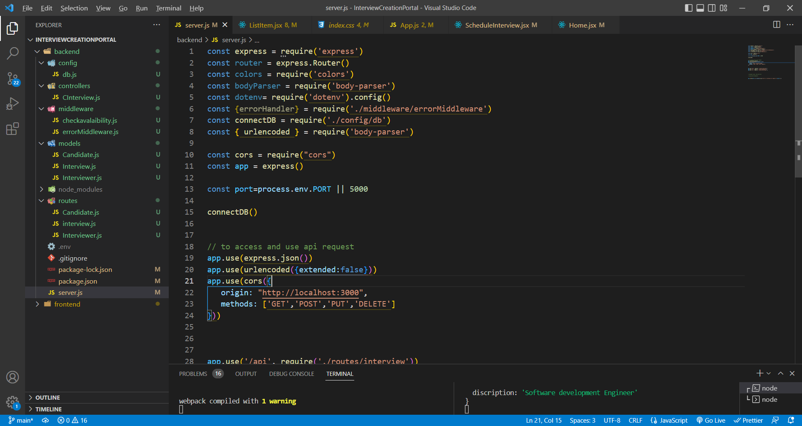
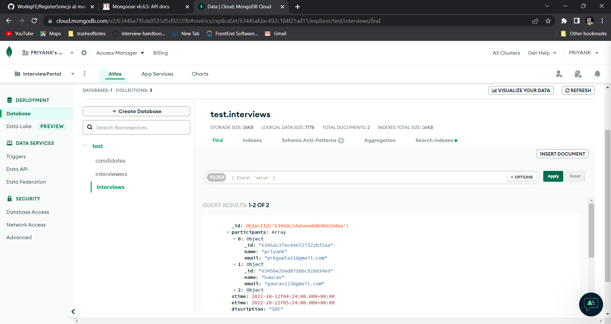
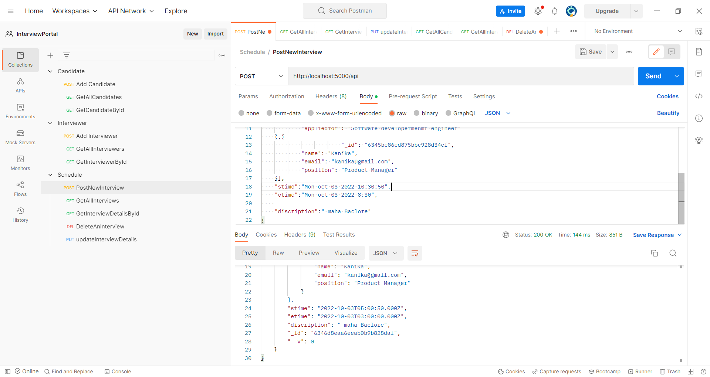

# Backend of InterView Creation Portal
### Tect used -- Node js , Express js , Mongo DB Atlas, Mongoose.
---
## frontend - https://github.com/priyank21116/Interview-Creation-Portal

---
#### File Structure
containing models, routes, controller

Mongo DB Atlas Database

### Postman- containing all functional neccesaryh APIs

## Basic Requirements
- An interview creation page where the admin can create an interview by selecting participants, start time and end time. Backend should throw error with proper error message if: 
-- Any of the participants is not available during the scheduled time (i.e, has another interview scheduled)
-- No of participants is less than 2
- An interviews list page where admin can see all the upcoming interviews.
- An interview edit component where admin can edit the created interview with the same validations as on the creation page.
